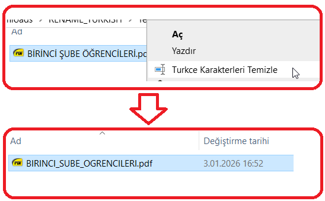

# Rename Turkish

Windows için dosya adlarındaki Türkçe karakterleri ASCII karşılıklarıyla değiştiren hafif ve hızlı bir araç.



## Özellikler

- Türkçe karakterleri ASCII karşılıklarına dönüştürür (ç→c, ğ→g, ı→i, İ→I, ö→o, ş→s, ü→u)
- Boşlukları alt çizgi (`_`) ile değiştirir
- Hem NFC hem NFD (decomposed) Unicode formatlarını destekler
- Windows sağ tık menüsüne entegre edilebilir
- Çok küçük boyut (~20 KB)
- Harici bağımlılık yok

## Karakter Dönüşüm Tablosu

| Türkçe | ASCII |
|--------|-------|
| ç, Ç   | c, C  |
| ğ, Ğ   | g, G  |
| ı, I   | i, I  |
| İ, İ   | I, I  |
| ö, Ö   | o, O  |
| ş, Ş   | s, S  |
| ü, Ü   | u, U  |
| (boşluk) | _   |

## Kurulum

### Hazır EXE Kullanımı

1. `rename_turkish.exe` dosyasını `C:\Tools\` klasörüne kopyalayın (veya istediğiniz bir konuma)
2. Sağ tık menüsüne eklemek için `install_context.reg` dosyasını çalıştırın
3. "Evet" diyerek registry değişikliğini onaylayın

> **Not:** EXE dosyasını farklı bir konuma kopyaladıysanız, `install_context.reg` dosyasındaki yolu düzenlemeniz gerekir.

### Kaynak Koddan Derleme

MinGW gereklidir. Derleme komutu:

```cmd
gcc -O2 -s -municode -o rename_turkish.exe rename_turkish.c
```

## Kullanım

### Komut Satırından

```cmd
rename_turkish.exe "Türkçe Dosya Adı.pdf"
```

**Örnek:**
```
rename_turkish.exe "Öğrenci Çalışma Notları.docx"
Basarili: Ogrenci_Calisma_Notlari.docx
```

### Sağ Tık Menüsünden

Kurulumdan sonra herhangi bir dosyaya sağ tıklayıp **"Turkce Karakterleri Temizle"** seçeneğini kullanabilirsiniz.

### Sürükle-Bırak

Dosyayı `rename_turkish.exe` üzerine sürükleyip bırakabilirsiniz.

## Sağ Tık Menüsü Entegrasyonu

### Kurulum

`install_context.reg` dosyasını çift tıklayın veya aşağıdaki içeriği `.reg` dosyası olarak kaydedin:

```reg
Windows Registry Editor Version 5.00

[HKEY_CLASSES_ROOT\*\shell\RenameTurkish]
@="Turkce Karakterleri Temizle"
"Icon"="shell32.dll,133"

[HKEY_CLASSES_ROOT\*\shell\RenameTurkish\command]
@="\"C:\\Tools\\rename_turkish.exe\" \"%1\""
```

### Kaldırma

`remove_context.reg` dosyasını çift tıklayın veya:

```reg
Windows Registry Editor Version 5.00

[-HKEY_CLASSES_ROOT\*\shell\RenameTurkish]
```

## Teknik Detaylar

### Unicode Desteği

Program iki farklı Unicode normalizasyon formatını destekler:

- **NFC (Composed):** Türkçe karakterler tek kod noktası olarak saklanır (örn: ş = U+015F)
- **NFD (Decomposed):** Karakterler taban harf + birleştirici işaret olarak saklanır (örn: ş = s + U+0327)

Bazı sistemler (özellikle macOS) NFD formatını kullandığı için, bu program her iki durumu da doğru şekilde işler.

### Neden C ile yazıldı?

- Minimum dosya boyutu (~20 KB)
- Hiçbir kütüphane veya runtime bağımlılığı yok
- Doğrudan Windows API erişimi
- Hızlı çalışma

## Dosyalar

| Dosya | Açıklama |
|-------|----------|
| `rename_turkish.c` | C kaynak kodu |
| `rename_turkish.exe` | Derlenmiş uygulama |
| `install_context.reg` | Sağ tık menüsüne ekleme |
| `remove_context.reg` | Sağ tık menüsünden kaldırma |
| `screenshot.png` | Ekran görüntüsü |

## Gereksinimler

- Tüm 64 bit Windows işletim sistemlerinde çalışır.
- Derleme için: MinGW-w64

## Lisans

MIT License

## Geliştirici

her türlü sorularınız için ttbilgin@gmail.com.
Turgay Tugay BİLGİN
